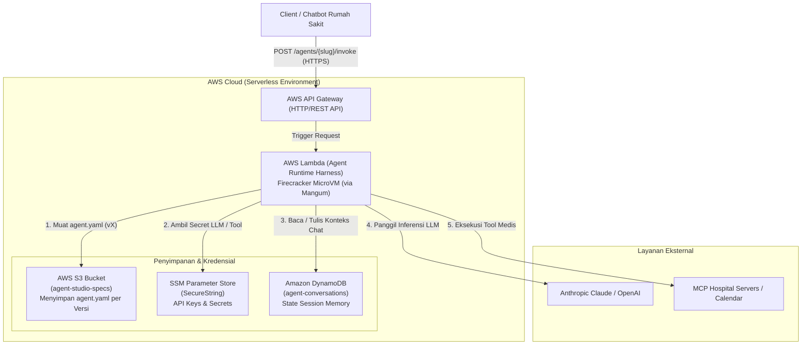

# Blueprint Arsitektur: Transisi Deployment Agent ke AWS Serverless (Lambda)

Dokumen ini merupakan cetak biru (*architectural blueprint*) dan panduan teknis implementasi untuk memigrasikan **Agent Runtime Harness** dari model **Virtual Machine (AWS EC2)** menuju arsitektur **Cloud-Native Serverless (AWS Lambda + API Gateway + S3 + Parameter Store + DynamoDB)**.

Rancangan ini disusun dengan memanfaatkan kuota **Always Free Tier** AWS secara maksimal sehingga sistem beroperasi dengan biaya \$0 (nol rupiah), tanpa pemeliharaan server fisik (*zero maintenance*), dan mampu melakukan *auto-scale* otomatis secara instan.

---

## 🏛️ 1. Diagram Arsitektur Target



---

## 💰 2. Analisis Biaya & Komponen (Always Free Tier)

| Komponen AWS | Peran dalam Arsitektur | Kuota Free Tier AWS | Status Biaya |
| :--- | :--- | :--- | :--- |
| **AWS Lambda** | **Execution Harness** (MicroVM Firecracker) yang membaca YAML dan mengeksekusi state machine per permintaan `/invoke`. | **1 Juta request/bulan** + 400.000 GB-detik komputasi per bulan. | **Always Free** (Selamanya) |
| **Amazon API Gateway** | **Endpoint Publik HTTPS** yang mengekspos Lambda ke publik dengan autentikasi API Key/Bearer. | **1 Juta panggilan API/bulan** (REST API) atau kuota HTTP API. | **Always Free** (Selamanya) |
| **Amazon S3** | **Immutable Config Store** untuk menyimpan arsip `agent.yaml` dengan fitur versioning snapshot. | 5 GB standard storage (cukup untuk ratusan ribu file YAML). | Gratis (12 bln / kredit) |
| **SSM Parameter Store** | **Secret Vault** menyimpan `OPENAI_API_KEY`, `ANTHROPIC_API_KEY`, dan token MCP rumah sakit. | Standard Parameters: **Gratis tanpa batas jumlah parameter**. | **Always Free** (KMS < 20rb req) |
| **Amazon DynamoDB** | **Conversation Memory** menyimpan history chat antar-turn pasien berdasarkan `session_id`. | **25 GB Storage** + 25 Read/Write Capacity Units (RCU/WCU). | **Always Free** (Selamanya) |

---

## 🔄 3. Perbandingan Pola Eksekusi

```
Pola Sekarang (EC2):
[Pasien Kirim Pesan] ──> [Server EC2 Hidup 24/7] ──> [RAM Menyimpan Sesi] ──> [Balasan]
                        (Bayar compute per jam walau tidak ada chat)

Pola Serverless (Lambda):
[Pasien Kirim Pesan] ──> [API Gateway] ──> [Spawn MicroVM Lambda (~50ms)]
                                              ├─ Ambil YAML dari S3
                                              ├─ Ambil Sesi dari DynamoDB
                                              ├─ Jalankan Node & LLM
                                              └─ Simpan Sesi ke DynamoDB
                     <── [Balasan]     <── [MicroVM Terminate / Freeze]
                        (Hanya bayar komputasi selama 2 detik saat chat diproses!)
```

---

## 🛠️ 4. Transformasi Kode Runtime ke Lambda (Menggunakan Mangum)

Kode [`agent_runtime_server.py`](file:///c:/Users/ASUS/OneDrive/Documents/GitHub/agent_studio/backend/agent_runtime_server.py) yang berbasis FastAPI tidak perlu dibuang. Cukup diadaptasi menjadi Lambda Handler menggunakan adapter **`Mangum`** dan library **`boto3`**.

### Struktur File di Lambda (`lambda_function.py`):

```python
import os
import json
import boto3
import yaml
from fastapi import FastAPI, HTTPException
from pydantic import BaseModel
from mangum import Mangum

# Inisialisasi AWS Clients
s3_client = boto3.client("s3")
ssm_client = boto3.client("ssm")
dynamodb = boto3.resource("dynamodb")
session_table = dynamodb.Table("agent_conversations")

app = FastAPI(title="Serverless Agent Runtime")

class InvokeRequest(BaseModel):
    message: str
    session_id: str

@app.post("/agents/{slug}/invoke")
async def invoke_agent_serverless(slug: str, req: InvokeRequest):
    # 1. Ambil spesifikasi agent.yaml dari S3 (Snapshot Versioned)
    s3_key = f"specs/{slug}/agent.yaml"
    s3_obj = s3_client.get_object(Bucket="agent-studio-specs-prod", Key=s3_key)
    spec_data = yaml.safe_load(s3_obj["Body"].read().decode("utf-8"))

    # 2. Ambil state percakapan sebelumnya dari DynamoDB
    ddb_res = session_table.get_item(Key={"session_id": req.session_id})
    history = ddb_res.get("Item", {}).get("messages", [])

    # 3. Ambil API Key LLM dari SSM Parameter Store (SecureString)
    ssm_param = ssm_client.get_parameter(
        Name=f"/agent-studio/{slug}/llm-key", 
        WithDecryption=True
    )
    llm_api_key = ssm_param["Parameter"]["Value"]

    # 4. Eksekusi alur graph state machine (Logika yang sama persis dengan sekarang)
    # ... eksekusi LLM step / Tool call ...
    agent_reply = f"Halo dari Agent '{slug}', keluhan Anda sedang diproses."

    # 5. Simpan pembaruan riwayat sesi ke DynamoDB dengan TTL 7 hari
    history.append({"user": req.message, "agent": agent_reply})
    session_table.put_item(Item={
        "session_id": req.session_id,
        "agent_slug": slug,
        "messages": history,
        "ttl": int(time.time()) + (7 * 86400) # Auto-delete setelah 7 hari (Hemat storage)
    })

    return {
        "status": "success",
        "agent_slug": slug,
        "session_id": req.session_id,
        "response": agent_reply
    }

# Entrypoint resmi untuk AWS Lambda:
handler = Mangum(app)
```

---

## 🚀 5. Perubahan pada Tombol "Publish Agent" di Agent Studio

Saat tombol **Publish Agent** di frontend diklik:

```
[User Klik 'Publish Agent']
           │
           ▼
[Backend Agent Studio (FastAPI)]
  1. Validasi Skema & Graph YAML (seperti yang berjalan sekarang)
  2. Boto3: Upload agent.yaml ke S3 (`s3://agent-studio-specs/specs/{slug}/agent.yaml`)
  3. Boto3: Daftarkan API Key baru ke SSM Parameter Store
  4. Generate URL API Gateway:
     https://api-id.execute-api.ap-southeast-1.amazonaws.com/prod/agents/{slug}/invoke
           │
           ▼
[Frontend Menampilkan Kotak Hijau]:
Endpoint: https://api-id.execute-api.ap-southeast-1.amazonaws.com/prod/agents/{slug}/invoke
API Key : agy_live_xxx
```

---

## 📦 6. Template Infrastruktur Otomatis (AWS SAM / CloudFormation)

Saat nanti siap beralih, infrastruktur ini bisa dibuat hanya dengan **satu perintah** (`sam deploy`) menggunakan template `template.yaml` berikut:

```yaml
AWSTemplateFormatVersion: '2010-09-09'
Transform: AWS::Serverless-2016-10-31
Description: Agent Studio Serverless Runtime Stack (Always Free Tier)

Resources:
  # 1. DynamoDB Table untuk Memory Sesi
  ConversationTable:
    Type: AWS::DynamoDB::Table
    Properties:
      TableName: agent_conversations
      BillingMode: PAY_PER_REQUEST
      AttributeDefinitions:
        - AttributeName: session_id
          AttributeType: S
      KeySchema:
        - AttributeName: session_id
          KeyType: HASH
      TimeToLiveSpecification:
        AttributeName: ttl
        Enabled: true

  # 2. S3 Bucket untuk Menyimpan Konfigurasi YAML
  SpecsBucket:
    Type: AWS::S3::Bucket
    Properties:
      BucketName: !Sub "agent-studio-specs-${AWS::AccountId}"
      VersioningConfiguration:
        Status: Enabled

  # 3. AWS Lambda Function (Harness)
  AgentRuntimeFunction:
    Type: AWS::Serverless::Function
    Properties:
      FunctionName: agent-studio-runtime-harness
      Handler: lambda_function.handler
      Runtime: python3.12
      MemorySize: 512
      Timeout: 30
      Environment:
        Variables:
          SPECS_BUCKET: !Ref SpecsBucket
          TABLE_NAME: !Ref ConversationTable
      Events:
        ApiEvent:
          Type: HttpApi
          Properties:
            Path: /agents/{slug}/invoke
            Method: post
```

---

## 📅 7. Rencana Tahapan Migrasi (Roadmap)

Jika nanti Anda memutuskan untuk mulai memigrasikan:

* **Fase 1: Setup Bucket S3 & DynamoDB** (15 menit)
  - Buat bucket S3 `agent-studio-specs` untuk menyimpan `agent.yaml`.
  - Buat tabel DynamoDB `agent_conversations` (PK: `session_id`).
* **Fase 2: Packaging Lambda dengan Mangum** (20 menit)
  - Bungkus `agent_runtime_server.py` dengan adapter `Mangum`.
  - Zip package atau build via AWS Lambda Container.
* **Fase 3: Setup API Gateway** (10 menit)
  - Buat route `ANY /{proxy+}` menuju Lambda Function.
* **Fase 4: Integrasi Backend Studio** (15 menit)
  - Update `deployment.py` agar saat klik Publish, YAML langsung di-push ke S3 via `boto3`.
* **Fase 5: Cutover & Pengujian** (10 menit)
  - Jalankan test case di [`AGENT_TEST_CASES.md`](file:///c:/Users/ASUS/OneDrive/Documents/GitHub/agent_studio/AGENT_TEST_CASES.md) mengarah ke URL API Gateway baru.

Dokumen blueprint ini tersimpan permanen di repositori proyek Anda dan siap dijadikan acuan kapan pun Anda ingin mengeksekusi transisinya.
